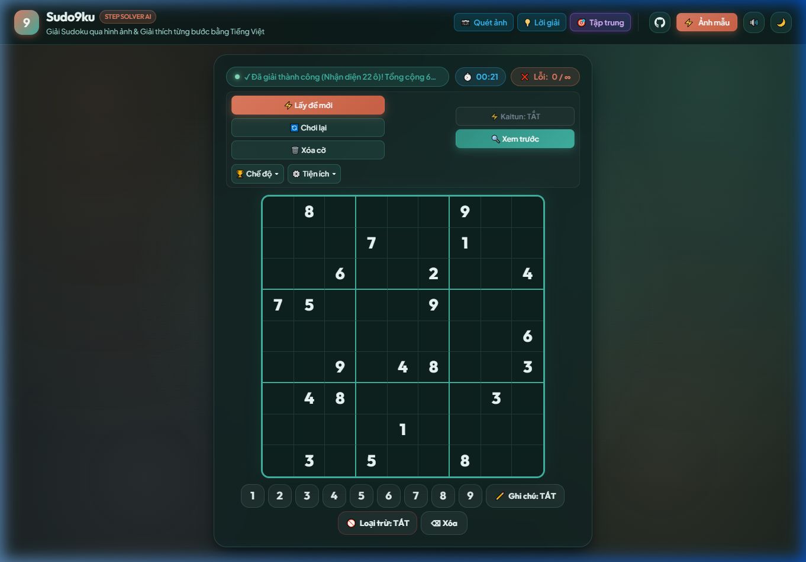
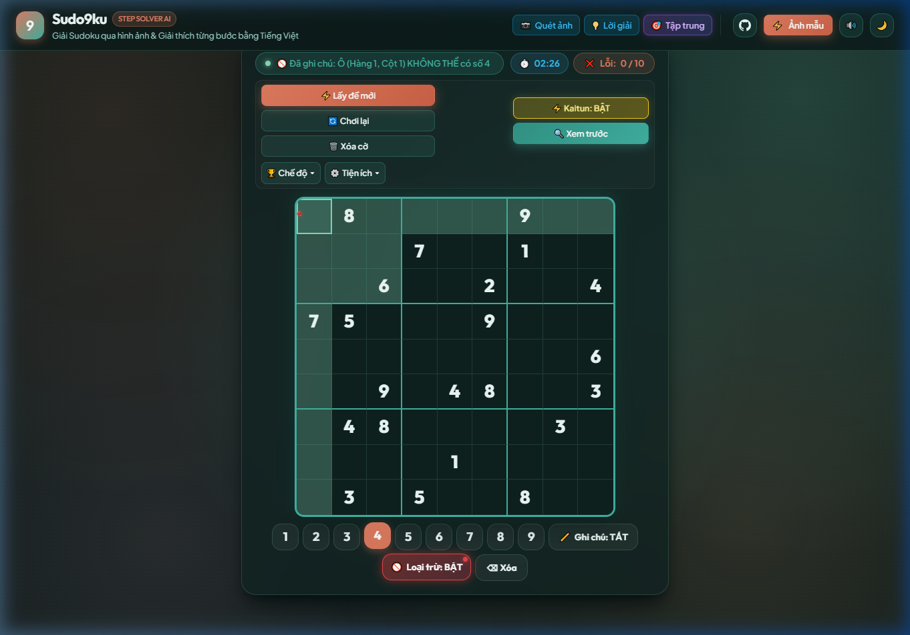
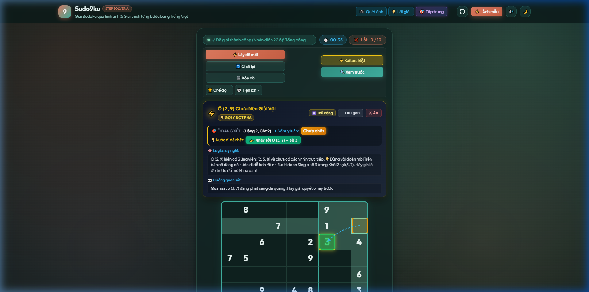
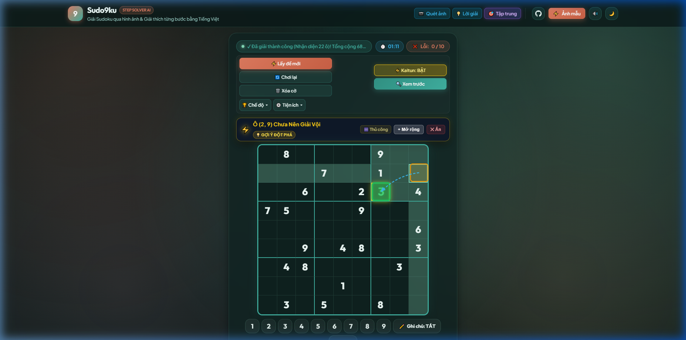

# 📘 Sudo9ku - Báo Cáo Đánh Giá Phát Hành & Cẩm Nang Sử Dụng Toàn Diện
*(Release Review, Feature Assessment & Teamwork Workflow Manual)*

> **Phiên bản:** v1.5.0-Stable  
> **Nền tảng hỗ trợ:** Web Browser (Desktop / Tablet / Mobile) & Android Mobile App (Capacitor/WebView)  
> **Ngôn ngữ giao diện:** Tiếng Việt (100% Thuần Việt)  
> **Mã nguồn:** [GitHub: tiennood/sudo9ku](https://github.com/tiennood/sudo9ku)

---

## 📑 Mục Lục
1. [Giới Thiệu & Tầm Nhìn Dự Án](#1-giới-thiệu--tầm-nhìn-dự-án)
2. [Ma Trận Tính Năng Mới & Đánh Giá Đột Phá](#2-ma-trận-tính-năng-mới--đánh-giá-đột-phá)
   - [2.1. Chế Độ Tập Trung (Zen Mode) Mặc Định](#21-chế-độ-tập-trung-zen-mode-mặc-định)
   - [2.2. Không Giới Hạn Lượt Sai (0 / ∞)](#22-không-giới-hạn-lượt-sai-0---)
   - [2.3. Hệ Thống Ghi Chú Kép: Nháp Thuận & Loại Trừ Nghịch](#23-hệ-thống-ghi-chú-kép-nháp-thuận--loại-trừ-nghịch)
   - [2.4. Trợ Thủ Suy Luận Thông Minh Kaitun & Sóng Laser Radar](#24-trợ-thủ-suy-luận-thông-minh-kaitun--sóng-laser-radar)
   - [2.5. Đấu Trường Sinh Tồn Extreme Arena](#25-đấu-trường-sinh-tồn-extreme-arena)
   - [2.6. Nhận Diện Đề Bài Qua Ảnh Bằng Trí Tuệ Nhân Tạo (OCR)](#26-nhận-diện-đề-bài-qua-ảnh-bằng-trí-tuệ-nhân-tạo-ocr)
3. [Bảng Phím Tắt Nhanh (Cheat Sheet)](#3-bảng-phím-tắt-nhanh-cheat-sheet)
4. [Kiểm Định Tính Đồng Bộ Đa Nền Tảng (Web vs. Android)](#4-kiểm-định-tính-đồng-bộ-đa-nền-tảng-web-vs-android)
5. [Quy Trình Làm Việc Nhóm & Đánh Giá Code (Teamwork Flow & Review)](#5-quy-trình-làm-việc-nhóm--đánh-giá-code-teamwork-flow--review)
   - [5.1. Git Branching Strategy](#51-git-branching-strategy)
   - [5.2. Code Review Checklist](#52-code-review-checklist)
   - [5.3. Quy Trình Đồng Bộ & Deploy](#53-quy-trình-đồng-bộ--deploy)

---

## 1. Giới Thiệu & Tầm Nhìn Dự Án

**Sudo9ku** là ứng dụng giải và luyện tập Sudoku thế hệ mới, kết hợp giữa thuật toán giải logic chuẩn mực quốc tế và trợ thủ suy luận trực quan hoá cao cấp. Không giống các phần mềm thông thường chỉ đưa ra đáp án máy móc, Sudo9ku tập trung vào:
- **Diễn giải trực quan:** Mỗi nước đi đều được chỉ rõ tọa độ hàng, cột, khối, kèm hình ảnh minh họa và logic suy luận bằng tiếng Việt dễ hiểu.
- **Tập trung cao độ:** Giao diện tối giản, loại bỏ hoàn toàn các yếu tố gây nhiễu, tôn vinh trải nghiệm giải đố thuần túy của người chơi.
- **Tiện nghi hiện đại:** Hỗ trợ quét ảnh chụp từ sách báo, tính năng đấu trường sinh tồn kịch tính, và hệ thống ghi chú loại trừ chuyên nghiệp.

---

## 2. Ma Trận Tính Năng Mới & Đánh Giá Đột Phá

### 2.1. Chế Độ Tập Trung (Zen Mode) Mặc Định
* **Mục tiêu:** Giảm thiểu tối đa sự phân tâm khi người chơi vừa bước vào ứng dụng.
* **Chi tiết cơ chế:**
  - Bàn cờ 9x9 và cụm bàn phím số được đưa về chính diện màn hình ở vị trí cân đối nhất.
  - Cột nhận diện ảnh bên trái và cột hướng dẫn lời giải bên phải được ẩn gọn gàng.
  - Nút **🎯 Tập trung** trên thanh tiêu đề giữ trạng thái hoạt động (`active`). Người dùng chỉ cần 1 cú nhấp chuột hoặc chạm tay để mở lại các bảng chi tiết khi cần.



---

### 2.2. Không Giới Hạn Lượt Sai (0 / ∞)
* **Mục tiêu:** Xóa bỏ áp lực "Game Over" đè nặng lên người chơi khi gặp các thế cờ hóc búa, khuyến khích tư duy thử nghiệm và tự do khám phá.
* **Chi tiết cơ chế:**
  - Bộ đếm lỗi trên thanh công cụ hiển thị: `❌ Lỗi: 0 / ∞`.
  - Người chơi có thể thoải mái thử các nhánh suy luận giả định mà không bao giờ bị khóa màn hình.
  - Khi cần chế độ thi đấu gắt gao (3 lỗi, 5 lỗi, 10 lỗi), người chơi có thể dễ dàng chuyển đổi trong menu **⚙️ Tiện ích ➔ Tùy chỉnh cài đặt**.

---

### 2.3. Hệ Thống Ghi Chú Kép: Nháp Thuận & Loại Trừ Nghịch
Sudoku hiện đại đòi hỏi 2 hình thức ghi chú ứng viên:
1. **Ghi chú thuận (Positive Pencil Mark):** Đánh dấu ô này *có thể* chứa số $X$.
2. **Ghi chú loại trừ (Negative Pencil Mark):** Đánh dấu ô này *chắc chắn KHÔNG THỂ* chứa số $X$.

* **Giao diện & Thao tác:**
  - Bổ sung nút **`🚫 Loại trừ: TẮT / BẬT`** nằm ngay cạnh nút **`✏️ Ghi chú`** trên bàn phím số và trong menu Tiện ích.
  - **Phím tắt:** Bấm **`X`** hoặc **`E`** để chuyển nhanh chế độ Loại trừ; bấm **`P`** hoặc **`N`** để chuyển chế độ Bút chì nháp.
  - **Hiển thị trực quan:** Số bị loại trừ hiển thị bằng **màu đỏ rực kèm nét gạch ngang (strike-through)** trong ô ứng viên nhỏ 3x3.
  - **Đồng bộ tự động:** Khi đánh dấu loại trừ số $X$, hệ thống tự động loại bỏ số $X$ khỏi danh sách số nháp thuận của ô đó.
  - Bảng thanh tra ô (Inspector) thông báo rõ: `🚫 Ghi chú KHÔNG THỂ có số: [X]`.



---

### 2.4. Trợ Thủ Suy Luận Thông Minh Kaitun & Sóng Laser Radar
* **Mục tiêu:** Hướng dẫn người chơi tìm ra nước đi dễ nhất trên bàn cờ khi gặp bế tắc, ưu tiên các nước đi từ Rất Dễ (Naked Single, Hidden Single) tới Nâng Cao (Pointing, Claiming, Pairs, Triples, X-Wing).
* **Cải tiến trong bản phát hành:**
  - **Mặc định TẮT:** Khi mới vào trang web, Kaitun ở trạng thái **TẮT** để bàn cờ hoàn toàn yên tĩnh, không gây rối mắt.
  - **Nút bật nhanh:** Nhấp vào `⚡ Kaitun` trên thanh công cụ bất kỳ khi nào muốn xem trợ giúp.
  - **Thu gọn / Mở rộng linh hoạt:**
    - Bấm **`[− Thu gọn]`** để đưa bảng giải thích về dạng một thanh bar nhỏ gọn (chỉ hiện tên kỹ thuật và huy hiệu độ khó).
    - Bấm **`[+ Mở rộng]`** để bung lại toàn bộ logic suy nghĩ và hướng quan sát.
  - **Nút `[✕ Ẩn]`:** Đã sửa lỗi co cụm dòng, hiển thị nằm ngang tinh tế, cho phép tắt bảng ngay lập tức.

| Trạng thái Mở rộng đầy đủ | Trạng thái Thu gọn tinh giản |
|:---:|:---:|
|  |  |

---

### 2.5. Đấu Trường Sinh Tồn Extreme Arena
* **Chế độ chơi kịch tính:**
  - Mỗi ván người chơi chỉ được giữ một số lượng chữ số nhất định (Săn số).
  - Áp dụng hệ quy chiếu góc nhìn chống nhìn trộm (Transform) và đồng hồ đếm ngược 10 phút.
  - 3 mạng sống (`❤️❤️❤️`). Có thể hy sinh 1 mạng lỗi (`💔 Đổi 1 lỗi lấy số`) hoặc kích hoạt Radar rọi sáng viền ô mục tiêu.

---

### 2.6. Nhận Diện Đề Bài Qua Ảnh Bằng Trí Tuệ Nhân Tạo (OCR)
* **Xử lý ảnh chuyên sâu:**
  - Tích hợp công nghệ lọc viền Adaptive Thresholding, làm sắc nét và nắn thẳng khung lưới bàn cờ.
  - Cho phép kéo thả chỉnh sửa 4 góc vùng cắt trực tiếp trên ảnh gốc.
  - Tự động kiểm tra tính duy nhất của nghiệm đề bài sau khi nhận diện xong.

---

## 3. Bảng Phím Tắt Nhanh (Cheat Sheet)

| Phím Tắt | Chức Năng | Ghi Chú |
|:---|:---|:---|
| **`1` – `9`** | Điền số hoặc Ghi chú vào ô đang chọn | Tuỳ thuộc chế độ thường hay chế độ bút chì |
| **`0`**, **`Delete`**, **`Backspace`** | Xóa số hoặc xóa toàn bộ ghi chú của ô | Hoạt động tức thì |
| **`P`** hoặc **`N`** | Bật / Tắt chế độ **Bút chì ghi nháp** | Chữ số nhỏ màu xanh ngọc |
| **`X`** hoặc **`E`** | Bật / Tắt chế độ **Ghi chú loại trừ (Cấm số)** | Chữ số nhỏ màu đỏ gạch ngang |
| **`Mũi tên` (← ↑ → ↓)** | Di chuyển ô đang chọn trên bàn cờ | Hỗ trợ điều hướng bàn phím |
| **`Space` (Phím cách)** | Tự động chơi / Dừng tự động giải | Chế độ xem máy giải |
| **`Escape`** | Đóng chế độ Soi công thức / Xem trước | Thoát nhanh về bàn cờ chính |

---

## 4. Kiểm Định Tính Đồng Bộ Đa Nền Tảng (Web vs. Android)

Toàn bộ mã nguồn Sudo9ku được thiết kế theo kiến trúc module thuần (Vanilla Web Components) không phụ thuộc framework cồng kềnh, mang lại hiệu suất tối đa:

```
sudoku/
├── index.html                  <-- Bản gốc Web (v1.5.0, cache-bust v=40)
├── css/style.css               <-- CSS hệ thống hoàn chỉnh
├── js/app.js                   <-- Trọng tâm logic ứng dụng
├── android/app/src/main/assets/www/
│   ├── index.html              <-- Đồng bộ 1:1 với Web
│   ├── css/style.css           <-- Đồng bộ 1:1 với Web
│   ├── js/app.js               <-- Đồng bộ 1:1 với Web
│   └── assets/, icons/         <-- Tài nguyên đồng bộ
```

### ✅ Kết Quả Kiểm Thử Nghiệm Thu:
1. **Kiểm tra cú pháp (`node --check`):** Đạt 100% không lỗi cú pháp JavaScript.
2. **Kiểm thử giao diện (UI/UX Verification):**
   - Chế độ Zen tập trung kích hoạt chuẩn xác, không bị vỡ layout khi co dãn từ màn hình 4K về điện thoại 360px.
   - Numpad trên điện thoại co dãn 9 cột hợp lý: hàng số 1-9 ở trên, hàng chức năng gồm 3 nút chia đều tỉ lệ 3 : 3 : 3 (`[✏️ Ghi chú] [🚫 Loại trừ] [⌫ Xóa]`).
3. **Bộ nhớ cục bộ (localStorage Isolation):** Các thiết lập người dùng được lưu trữ bền vững, không bị xung đột hay mất dữ liệu khi làm mới trang.

---

## 5. Quy Trình Làm Việc Nhóm & Đánh Giá Code (Teamwork Flow & Review)

Nhằm đảm bảo sự phối hợp nhịp nhàng, chất lượng mã nguồn cao và tốc độ phát hành ổn định cho các thành viên trong nhóm, quy trình cộng tác được chuẩn hóa như sau:

### 5.1. Git Branching Strategy
* **`main`:** Nhánh phát hành chính thức (Production). Chỉ merge sau khi đã vượt qua toàn bộ test suite.
* **`develop`:** Nhánh tích hợp các tính năng mới trước khi đóng gói phát hành.
* **`feature/<ten-tinh-nang>`:** Nhánh phát triển của từng thành viên (ví dụ: `feature/negative-pencil-mark`, `feature/zen-mode-default`).

### 5.2. Code Review Checklist (Bảng Kiểm Tra Khi Review)
Trước khi phê duyệt một Pull Request (PR), người review cần kiểm tra các tiêu chí:
- [ ] **Mã nguồn thuần Việt & Thân thiện:** Giữ nguyên các ghi chú giải thích thuật toán bằng tiếng Việt trong sáng, dễ hiểu.
- [ ] **Khả năng tương thích Windows PowerShell:** Chạy các lệnh CLI (npm, node) tuân thủ quy tắc `.cmd` đã thiết lập.
- [ ] **Đồng bộ song hành Android:** Mọi thay đổi tại thư mục gốc (`index.html`, `css/`, `js/`) **bắt buộc phải được copy đồng bộ** sang `android/app/src/main/assets/www/`.
- [ ] **Cache Busting:** Khi cập nhật JS hoặc CSS, luôn tăng query version `?v=...` trong `index.html` để người dùng không bị kẹt cache trình duyệt cũ.
- [ ] **Không làm phá vỡ Responsive:** Kiểm tra giao diện trên cả màn hình Desktop (>1200px) và Mobile (<768px).

### 5.3. Quy Trình Đồng Bộ & Deploy
Mỗi khi kết thúc một chu kỳ cập nhật, thực thi lệnh đồng bộ tự động:
```powershell
Copy-Item -Path index.html -Destination android/app/src/main/assets/www/index.html -Force;
Copy-Item -Path css/style.css -Destination android/app/src/main/assets/www/css/style.css -Force;
Copy-Item -Path css/style.css -Destination android/app/src/main/assets/www/style.css -Force;
Copy-Item -Path js/app.js -Destination android/app/src/main/assets/www/js/app.js -Force;
Copy-Item -Path js/app.js -Destination android/app/src/main/assets/www/app.js -Force;
```

---

*Tài liệu được biên soạn và kiểm định tự động bởi **Antigravity AI Collaboration Engine**.*
